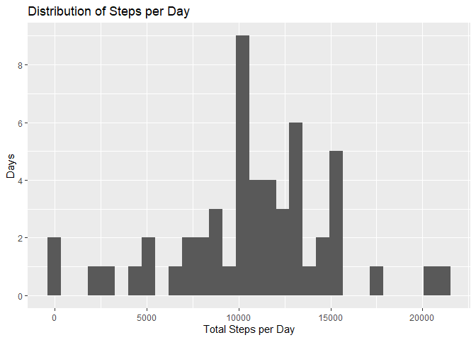
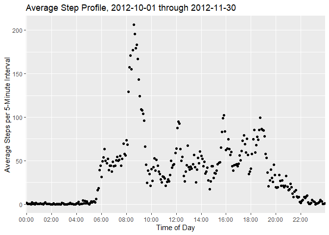
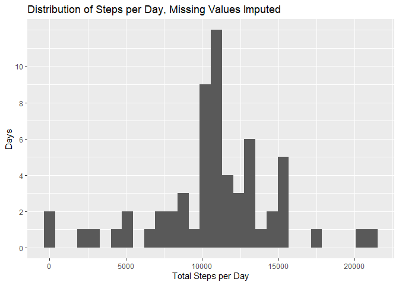
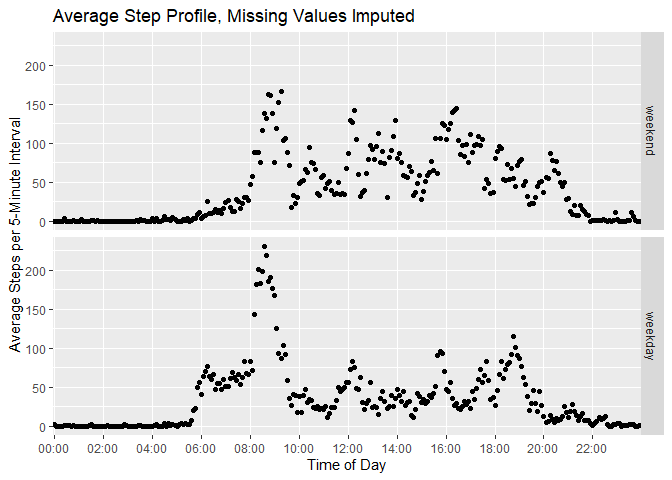

```r
knitr::opts_chunk$set(message = FALSE, warning = FALSE)
```

## Introduction
Personal movement data for this assignment were collected from a personal activity monitoring device. Data were collected at 5-minute intervals, 24 hours a day for a period of two months during October and November of 2012. Each data point indicates the number of steps taken during a 5-minute interval. The raw dataset includes 17,568 observations of 5 variables:

* **steps**: The number of steps taken in a 5-minute interval
* **date**: The date on which the measurement was taken (YYYY-MM-DD)
* **interval**: The time of the start of the 5-minute interval (HHMM)

## Loading and preprocessing the data
Data are in comma-separated value format, and therefore are read in with read.csv

```r
# Import and take a look at the data
act <- read.csv("repdata_data_activity/activity.csv")
head(act)
```

```
##   steps       date interval
## 1    NA 2012-10-01        0
## 2    NA 2012-10-01        5
## 3    NA 2012-10-01       10
## 4    NA 2012-10-01       15
## 5    NA 2012-10-01       20
## 6    NA 2012-10-01       25
```

```r
str(act)
```

```
## 'data.frame':	17568 obs. of  3 variables:
##  $ steps   : int  NA NA NA NA NA NA NA NA NA NA ...
##  $ date    : Factor w/ 61 levels "2012-10-01","2012-10-02",..: 1 1 1 1 1 1 1 1 1 1 ...
##  $ interval: int  0 5 10 15 20 25 30 35 40 45 ...
```

## What is the total number of steps taken each day (ignoring missing data)?

To calculate the total steps by day, the summarize function from the dplyr library was used.

```r
# Calculate the number of steps taken each day
library(dplyr)
byDay <- summarize(group_by(act, date), totSteps = sum(steps))
```

A histogram shows the distribution of the total steps taken per day over this two-month period (61 observations).

```r
# Plot the number of steps taken each day
library(ggplot2)
qplot(totSteps, data = byDay, geom = "histogram") + 
    scale_y_continuous(breaks = seq(0, 10, 2)) + 
    labs(x = "Total Steps per Day", y = "Days", 
         title = "Distribution of Steps per Day")
```

<!-- -->

The mean and median values of this summary dataset were calculated.

```r
# Calculate the 5-number summary (plus mean) of the number of steps taken each day
stepStats <- summary(byDay$totSteps)    #stepStats["Median"], stepStats["Mean"]
meanSteps <- stepStats["Median"]
medianSteps <- stepStats["Mean"]
```

The the mean of the average number of steps taken each day was 1.0765\times 10^{4} steps and the median was 1.0766189\times 10^{4} steps.

## What is the average activity pattern?

The average number of steps was calculated for each 5-minute interval throughout the day, averaged across all days. The interval was converted to a HH:MM format and these data were plotted on a time-series plot. The interval with the greatest number of steps was also determined.

```r
# Calculate and plot the daily activity pattern
bySample <- summarize(group_by(act, interval),
                      avgSteps = mean(steps, na.rm = TRUE))

# Pad interval with zeros and convert to char
bySample <- cbind(bySample, intervalFMT = sprintf("%04d", bySample$interval))

# Format into a time
bySample$intervalFMT <- format(strptime(bySample$intervalFMT, format = "%H%M"),
                            format = "%H:%M")
# Plot the time-series data
qplot(intervalFMT, avgSteps, data = bySample) +
    scale_x_discrete(breaks = bySample$intervalFMT[
        seq(1, length(bySample$intervalFMT), 120/5)]) + 
    labs(x = "Time of Day", y = "Average Steps per 5-Minute Interval", 
         title = "Average Step Profile, 2012-10-01 through 2012-11-30")
```

<!-- -->

```r
# Determine which interval contained the maximum number of steps.
maxInt <- bySample$intervalFMT[which.max(bySample$avgSteps)]
```

On average across all the days in the dataset, the 5-minute interval that contained the greatest number of steps was 08:35.

## Impute missing values
There were a number of missing values, encoded as NA, in the dataset. The total number of NA's was calculated.

```r
# Get the total number of NA's
missVals <- sum(is.na(act$steps))
missPercent <- missVals/nrow(act)*100
```

In total there were 2304 missing rows, accounting for 13.1147541 % of the total observations.

Three strategies were considered for imputing the missing values.

    1. Replace the missing values with the average number of steps from the day during which they occurred.
    2. Replace the missing values with the average number of steps from the interval during which they occurred.
    3. Replace the missing values with the average value computed from their nearest neighbors.

Option 1 would skew the daily step profile, increase the number of steps taken each day, and not work for days where there were no step data. Option 2 would preserve the daily step profile, increase the number of steps, and would work for days with no step data.  It would not work for any intervals with no step data, but there were none. Option 3 also would not work for days wtih no step data, but would probably provide the most reasonable estimations for short segments of missing data.

Ultimately, it was decided to replace the missing values with the average value from the interval during which they occurred. To accomplish this, first an array was created which identified the row indicies that contained an NA for the step value. This index was then used to get the time interval of the missing value, which was in turn used to determine the index of the corresponding row in the by-interval summary array.


```r
# Get the index of the missing values
missI <- which(is.na(act$steps))

# Correlate the interval of the missing values to the data averaged by sample
foundI <- match(act[missI, "interval"], bySample$interval)
```

A copy of the original data set was created to preserve the original when the missing values were replaced with imputed values.


```r
# Create a new dataset equal to the old dataset
actImpute <- act

# Replace the missing values with the average from that time of day
actImpute[missI, "steps"] <- bySample[foundI, "avgSteps"]
```

The total number of steps each day was calculted for the imputed dataset. A histogram was made of the total number of steps taken each day and the mean and median were again determined.


```r
# Calculate the total steps each day with the imputed data
byDayImp <- summarize(group_by(actImpute, date), totSteps = sum(steps))
qplot(totSteps, data = byDayImp, geom = "histogram") + 
    scale_y_continuous(breaks = seq(0, 10, 2)) + 
    labs(x = "Total Steps per Day", y = "Days", 
         title = "Distribution of Steps per Day, Missing Values Imputed")
```

<!-- -->

```r
# Calculate the 5-number summary, plus mean
stepStatsImp <- summary(byDayImp$totSteps)

# Assign results to variables
impMean <- stepStatsImp["Mean"]
impMedian <- stepStatsImp["Median"]
incMean <- stepStatsImp["Mean"] - stepStats["Mean"]
incMed <- stepStatsImp["Median"] - stepStats["Median"]
```

For the imputed data, the the mean of the average number of steps taken each day was 1.0766189\times 10^{4} steps and the median was 1.0766189\times 10^{4} steps.

Compared to the original dataset with missing values, the mean increased by 0 (i.e. no change, because the mean value was used to fill in missing values). The median had a modest increase of `incMed`.

## Are there different activity patterns between weekdays and weekends?

To determine if the average daily pattern differed between weekdays and weekends, the date values were converted from strings to date values.  The dates could then be used to determine the day of the week, which was in turn compared to the 5 weekdays to determine if each date value was a weekday or a weekend.  This information was then appended to the imputed dataset from the previous section.


```r
# Convert the string date to a date class
actImpute$date <- as.Date(as.character(actImpute$date, format = "%Y-%m-%d"))

# Determine the day of the week and whether it is a weekday or weekend
weekdayL <- weekdays(actImpute$date) %in%
    c("Monday", "Tuesday", "Wednesday", "Thursday", "Friday")

# Convert the logical to a factor
weekdayL <- factor(weekdayL, labels = c("weekend", "weekday"))

# Add the factor to the dataset
actImpute <- cbind(actImpute, weekdayL)
```

Data were then grouped by the 5-minute interval as well as whether it was on a weekday or a weekend.  The average number of steps for each group was then calculated.  The interval was again formatted to HH:MM for plotting purposes and a panel plot was made showing the average daily step profile for weekdays and weekends.


```r
# Calculate the average steps per interval for weekdays and weekends
bySampleImp <- summarize(group_by(actImpute, interval, weekdayL),
                         avgSteps = mean(steps))
# Pad interval with zeros and convert to char
bySampleImp <- cbind(bySampleImp, 
                     intervalFMT = sprintf("%04d", bySampleImp$interval))
# Format into a time
bySampleImp$intervalFMT <- format(strptime(bySampleImp$intervalFMT, 
                                           format = "%H%M"), format = "%H:%M")
# Make a panel plot containing the 5-minute interval averages
par(mfrow = c(2,1))
qplot(intervalFMT, avgSteps, data = bySampleImp, facets = weekdayL ~ .) +
    scale_x_discrete(breaks = bySampleImp$intervalFMT[
        seq(1, length(bySampleImp$intervalFMT), 240/5)]) + 
    labs(x = "Time of Day", y = "Average Steps per 5-Minute Interval", 
         title = "Average Step Profile, Missing Values Imputed")
```

<!-- -->

Comparing the two datasets, it appears that there is a distinct increase in steps between the hours of 06:00 and 10:00 in the morning on weekdays, but then less activity throughout late morning and afternoon when compared to the weekend.  The weekdays are also more consistent with less variablility in the data for a given hour.


